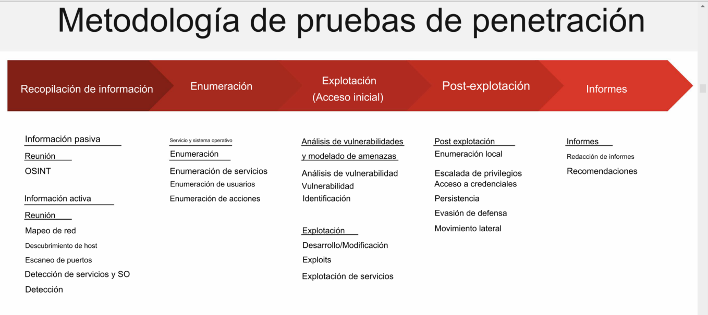

# Enumeración

La enumeración es la fase donde se recopila información detallada sobre un sistema objetivo, después del reconocimiento inicial. 

Después de la fase de descubrimiento del host y escaneo de puertos de una prueba de penetración, la siguiente fase lógica implicará la enumeración de servicios.

El objetivo de la enumeración de servicios es recopilar información adicional y más completa. Información específica detallada sobre los hosts/sistemas en una red y los servicios que se ejecutan en dichos hosts.

Esto incluye información como nombres de cuentas, recursos compartivos, configuraciones incorrectas, servicios y demás.

Al igual que la fase de escaneo, la enumeración implica conexiones activas a los dispositivos remotos en la red.

hay muchos protocolos en sistemas en red que un atacante puede atacar si han sido mal configurados o se han dejado habilitados. 

## Metodología de pruebas de penetración

---

## Escaneo y enumeración de puertos con NMAP

Nmap es un escáner de red gratuito y de código abierto que se puede utilizar para descubrir hosts en una red, así como para escanear objetivos en busca de puertos abiertos.

    💻 Hecho con 💚 por <strong>Marcela</strong> - 2025

